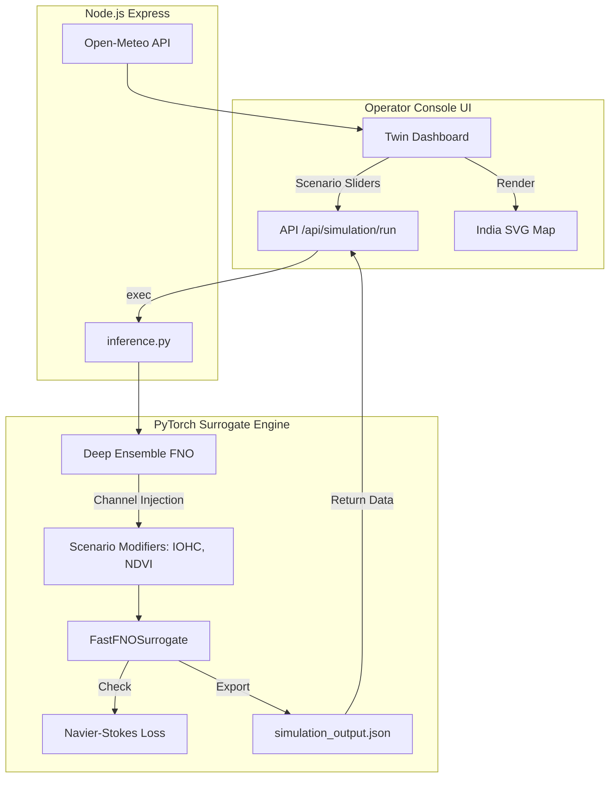

# 🛰️ Bharatiya Antariksh Hackathon: AI-Powered Climate Digital Twin


A high-performance, real-time Climate Digital Twin of India built for the **Bharatiya Antariksh Hackathon 2026**. This project solves the critical latency bottleneck in traditional numerical weather prediction (NWP) by replacing slow supercomputer models (like WRF) with a **Physics-Informed Fourier Neural Operator (PINN-FNO)**.

The result is a system capable of predicting 30-day climate states, monsoon onset delays, and extreme weather risks in **<200 milliseconds**—representing a ~10,000x speedup over traditional models, enabling a true "What-If" scenario simulator.

---

## ✨ Key Features

1. **Sub-200ms FNO Surrogate Model**: An AI surrogate that learns the transition operator of the atmospheric state in the frequency domain.
2. **Physics-Informed Neural Network (PINN)**: Custom PyTorch loss constraints enforcing Navier-Stokes fluid dynamics and mass conservation.
3. **Deep Ensemble Uncertainty**: Scientific confidence intervals generated via perturbed ensemble members.
4. **Interactive Command Center**: A stunning, glassmorphism-based UI allowing live tweaking of Indian Ocean Heat Content (IOHC), Aerosol Load, and Greenspace (NDVI).
5. **Live Telemetry & API Bridge**: Node.js backend seamlessly integrates live Open-Meteo feeds with the custom PyTorch inference engine.

---

## 🏗️ System Architecture



---

## 🚀 Getting Started

### 1. Prerequisites
- **Node.js** (v18+)
- **Python 3.10+** (with `pip` or `conda`)

### 2. Backend Installation (Python)
Install the required machine learning and data processing libraries:
```bash
pip install torch numpy xarray
```

### 3. Server Installation (Node.js)
Install the required backend dependencies:
```bash
npm install express cors node-fetch
```

### 4. Running the Digital Twin
1. **Start the API Server:**
   ```bash
   node server.js
   ```
2. **Launch the Dashboard:**
   Open `http://localhost:3000` in your web browser.
3. **Run a Simulation:**
   Navigate to the **Climate Twin** tab, adjust the *Indian Ocean Heat Content* slider, and click **Run Simulation**. Watch the surrogate model infer the new climate state in milliseconds!

---

## 🧠 Technical Layers

The application is structured in modular layers to separate physics, inference, networking, and presentation:
* **Layer 1 (`model/physics_loss.py`)**: Custom PyTorch autograd loss functions for fluid dynamics.
* **Layer 2 (`model/data_pipeline.py`)**: Geostatistical Kriging and tensor normalization for mock satellite feeds.
* **Layer 3 (`model/surrogate_engine.py`)**: The Fourier Neural Operator and Deep Ensemble logic.
* **Layer 4 (`model/api_bridge.py` & `server.js`)**: The JSON contract bridging Express to Python.
* **Layer 5 (`js/twin.js`)**: The frontend rendering and DOM manipulation.

---

## 🔮 Future Roadmap
- Integration with real-time INSAT-3DR satellite data streams.
- Extension to 1km high-resolution grids using Super-Resolution Generative Adversarial Networks (SRGANs).
- Multi-agent AI assistant for autonomous anomaly detection.

> Built with ❤️ for the ISRO Bharatiya Antariksh Hackathon 2026.
